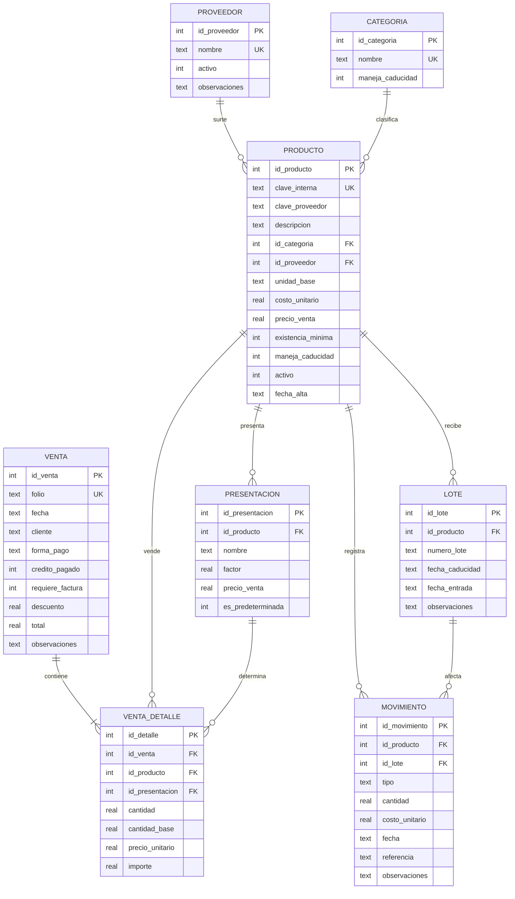

# Modelo de datos

Sistema de control de inventario y análisis de ventas
Depósito Dental HERSON

Estadía profesional, Ingeniería en Sistemas Computacionales, UVEG
Actividad 2 del cronograma: diseño del modelo de datos

El diagrama se mantiene como código para que pueda regenerarse si el
modelo cambia durante el desarrollo. La fuente de verdad del esquema es
el archivo `basedatos/esquema.sql`.

## Diagrama entidad-relación

## Notación

`||--o{` es una relación de uno a muchos donde el lado de muchos es
opcional. Un proveedor puede surtir varios productos o ninguno.

`||--|{` es una relación de uno a muchos obligatoria. Una venta tiene al
menos un renglón, porque una nota sin productos no existe.

`PK` es llave primaria, `FK` llave foránea y `UK` restricción de unicidad.

## Decisiones de diseño

**La existencia no se almacena, se calcula.** No hay columna de
existencia en `producto`. El dato se obtiene sumando los movimientos del
producto, lo que permite explicar en todo momento por qué hay lo que hay.
Guardar la existencia como campo fijo y además registrar movimientos
duplicaría el dato y reproduciría el problema que ya tiene el archivo de
Excel.

**La clave interna sustituye a la del proveedor.** En el inventario
actual hay 248 renglones sin clave y 75 claves repetidas en 316 filas,
porque cada proveedor usa su propia nomenclatura. La clave del proveedor
se conserva en una columna aparte, ya que sigue siendo necesaria para
hacer pedidos.

**Las presentaciones resuelven el mayoreo y el menudeo.** El factor de
conversión indica cuántas unidades base entrega cada presentación, de
modo que la venta de una caja descuente las piezas que contiene. Sin él,
la existencia se descuadra en la primera venta de mayoreo.

**El lote admite nulos.** El número de lote y la fecha de caducidad
vienen en el empaque y en la factura, pero no siempre. Es preferible que
el campo quede vacío y sea visible que falta, a obligar a capturar un
dato inventado.

**El precio se congela en el detalle de la venta.** El importe cobrado se
guarda tal como ocurrió, en lugar de leerse del catálogo, porque los
precios cambian y el histórico debe reflejar la realidad de cada venta.

**El cliente no tiene tabla propia.** Las notas del depósito registran el
nombre solo cuando hay crédito o factura, por lo que se almacena como
texto en la venta. Un catálogo de clientes sería construir algo que el
negocio no utiliza.

## Vistas

`v_existencia` entrega la existencia actual por producto a partir de la
suma de movimientos, junto con su categoría, proveedor, costo y precio.

`v_por_reabastecer` filtra los productos activos cuya existencia llegó o
bajó de la mínima configurada, y sustituye la revisión visual de
anaqueles del proceso actual.

`v_caducidad_proxima` lista los lotes con existencia que caducan dentro
de los siguientes 180 días, plazo definido por el propietario.

`v_ventas_plano` entrega una fila por renglón vendido, ya desnormalizada
y con la utilidad estimada calculada, que es la fuente del archivo que
consume el tablero de Power BI.
